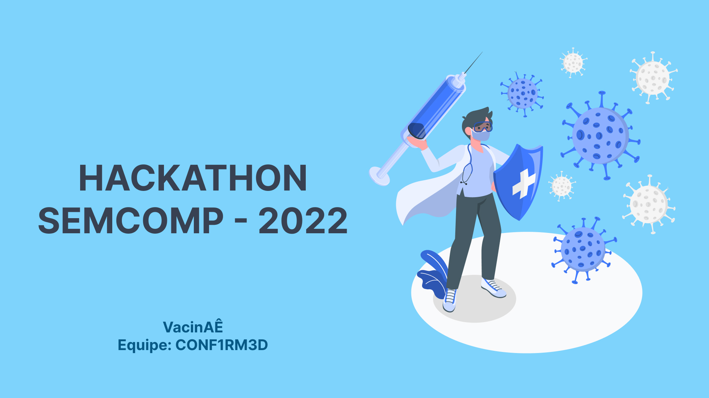

## vacinAÊ backend

https://semcomp-backend-2022.herokuapp.com

### [Fazendo requisições no Insomnia](./docs/Insomnia_vacinAEv3.har) - Importe o arquivo

### Hackathon Semcomp 2022:

Proposta: As equipes do Hacktahon SEMCOMP 2022 deverão
entregar uma solução tecnologica e criativa que envolva
pelo menos um dos [17 objetivos para o
desenvolvimento o sustenstável](https://brasil.un.org/pt-br/sdgs).

### Equipe CONF1RM3D:

- Eu
- [Elis Marcela](https://github.com/develis)
- [Monique Silva](https://github.com/moniquedsilva)

### Nossa solução:

- Principal Objetivo: 3 - Saúde e bem estar
- Sistema web para gerenciamento e histórico de vacinas pessoais ou de dependentes.
- [Modelo de negócios](./docs/ModeloNegociosVacinae.pdf)
- [Design](https://www.figma.com/file/nHwxEmniePGeRbaOpsCFML/Semcomp?node-id=46%3A187)
- [Repositório Front-end](https://github.com/moniquedsilva/hackaton-semcomp-frontend)
- [Slides do Pitch](./docs/Pitch_SEMCOMP.pdf)

### Como utilizar

1. Clone o repositório
2. `npm i`
3. Preencha um arquivo .env de acordo com o .env-example
4. `npm start`
5. Faça requisições ao localhost:3000 de acordo com a documentação

Insomnia:

1. Utilize as requisições na ordem fornecida a princípio, lembrando de autenticar suas requisições com Bearer '<access_token>', após isso pode requisitar na ordem desejada.
